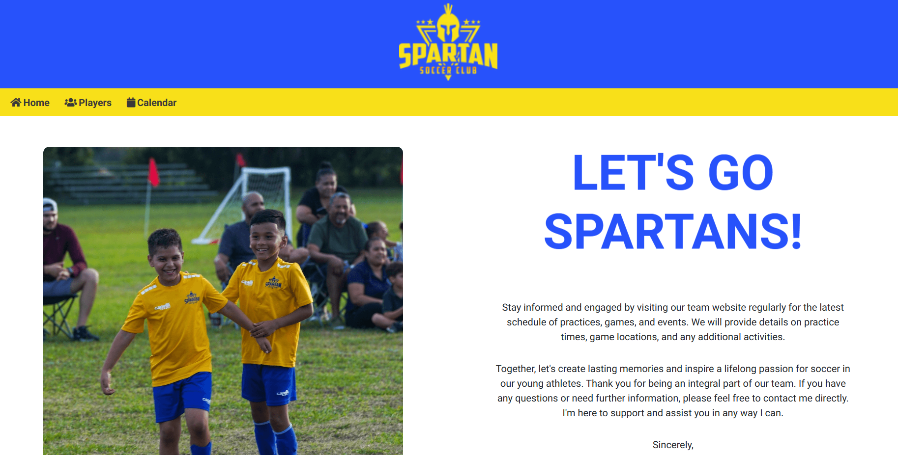

# Responsive_Portfolio

HTML: Used for the structure and content of the web pages.

CSS: Used for styling and formatting the appearance of the web pages.

JavaScript: Used for adding interactive and dynamic elements to the web pages.

Python: Used for the server-side logic and to create the Flask web application.

Flask: A micro web framework in Python used for handling routes and rendering templates.

Google Sheets API: Used to access and retrieve data from a Google Sheets spreadsheet.

Pandas: A Python library used for data manipulation and analysis, particularly for converting Google Sheets data to a DataFrame.

JSON: Used to represent and transfer data between the backend and frontend, particularly for passing events data to the FullCalendar.

FullCalendar: A JavaScript library used for displaying and managing events on a calendar.

Bootstrap: A popular front-end framework used for responsive and mobile-friendly designs.

jQuery: A JavaScript library used for DOM manipulation and event handling.

Font Awesome: A library of icons and fonts used for adding icons to the website.

Google Fonts: Used for importing custom fonts for the website.

Git: A version control system used for managing and tracking changes in the code.

GitHub: A hosting service for Git repositories, used for storing and managing the website's code.

Jinja2: A templating engine used with Flask to render dynamic content in HTML templates.

Render: A platform used for deploying and hosting web applications.

# Screenshot of app

# Demo video of Desktop version

# Demo video of Mobile version

.gif>)
